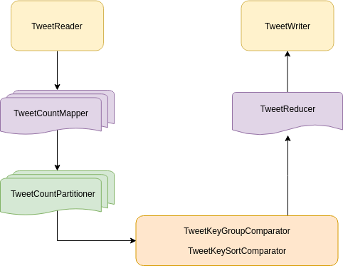

# Twitter Analysis with Hadoop

## Requirements

- Java 8
- Maven (build with 3.0.5)
- Hadoop (build with 2.4.0)

## Environment setup

Data, contains tweets related to the presidential election in 2012. It is available at this [DataHub repository](https://datahub.io/jgoodman8/twitter-2012-presidential-election/v/1).

Next step is store the JSON file at the HDFS. So, let's create a folder named `tweets/` and put our JSON file inside it.

```{bash}
hadoop fs -mkdir tweets
hadoop fs -put <path-to-JSON-file> tweets
```

## Build

The package build command should generate a self-contained jar, which includes all the library dependencies and a manifest.

```{bash}
mvn clean
mvn package
```

## Execution

From the project root, just run:

```{bash}
hadoop jar target/twitter_analysis-1.0-SNAPSHOT-jar-with-dependencies.jar tweets/cache-1000000.json tweets/out
```

Once the execution is completed, the folder `tweets/out` should have been generated, containing the output files.

```{bash}
hadoop fs -ls tweets/out
```

The number of resuling chunks should be the same as the reducers set at the application. The next command merges all the parts into a single csv file.

```{bash}
hadoop fs -getmerge -nl tweets/out stats.csv
```

## Architecture



